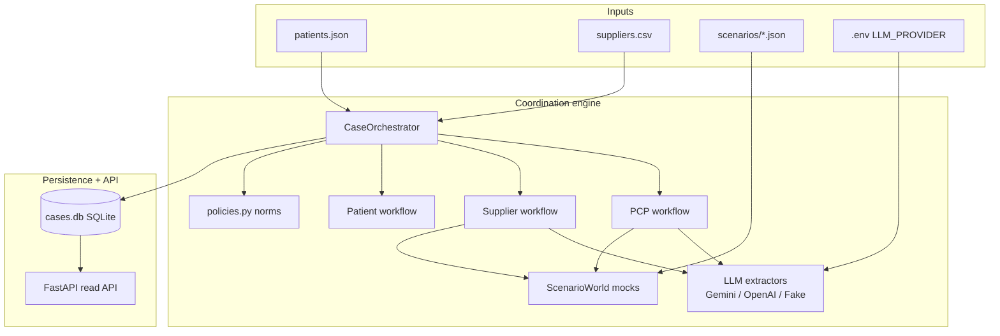
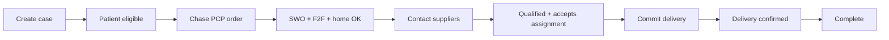
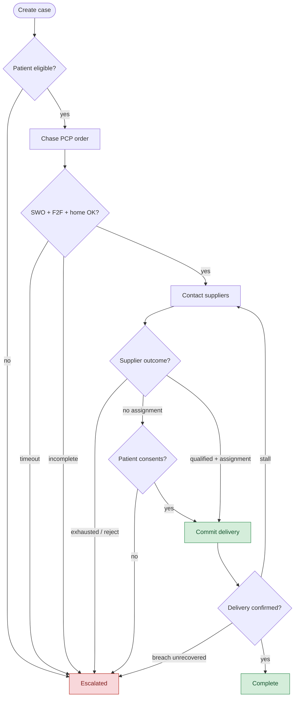

# Mira Mace — DME Coordination Prototype

Coordinates getting a **standard manual wheelchair (HCPCS K0001)** to a Medicare patient: chase the PCP for a complete written order, match a viable DME supplier, confirm delivery, and escalate when policy or vendors block the path.

**Design principle:** LLMs interpret · Rules validate · Orchestrator decides · Mocks act · Events record

This is a lean backend prototype (no LangChain/LangGraph). The deep slice is **supplier matching and order confirmation** under Medicare-oriented policy, with PCP paperwork and patient consent in the loop when a supplier will not accept assignment (~20% coinsurance path / balance-billing risk).

---

## What this solves (business)

| Party | Problem the system addresses |
| --- | --- |
| **Patient** | Needs equipment quickly; must understand cost if a supplier does not accept Medicare assignment |
| **PCP** | Must produce a signed Standard Written Order (SWO), face-to-face eval, home assessment |
| **Supplier** | Must accept new patients, enroll in Part B, stock/deliver K0001, preferably accept assignment |
| **Ops / Mira** | Sequence unreliable phone follow-ups, enforce policy gates, recover from stalls, escalate cleanly |

**In scope for this build:** eligibility gates, PCP order chase, supplier search → qualify → commit → confirm, patient yes/no on non-assignment, scenario demos, read-only case API.

**Out of scope (deliberate):** real telephony/EHR, claim submission, full LCD text, production auth/UI, Temporal/agent frameworks.

---

## What was built



### Happy-path case flow

Successful coordination end-to-end (`make 1`, `make 4`–`6`):



### Case decision flow (design)

General orchestration design: green = success terminals / committed path; red = failed / escalated. Edge labels name the reason (demos `make 2`, `3`, `8`–`12` hit the red paths; `make 1` / `10` reach green).



| Red path | Escalation reason | Demo |
| --- | --- | --- |
| Patient fails K0001 gates | `PATIENT_NOT_ELIGIBLE` | `make 11` |
| PCP silent after retries | `PCP_UNRESPONSIVE` | `make 2` |
| Verbal / incomplete order | `ORDER_INVALID` | `make 8` |
| No viable supplier left | `NO_SUPPLIER_AVAILABLE` | `make 9` |
| Commitment stall / breach | `SUPPLIER_COMMITMENT_BROKEN` | `make 3` |
| Non-assignment, patient declines | `ASSIGNMENT_CONSENT_DECLINED` | `make 12` |
| Non-assignment, patient accepts | *(green — book)* | `make 10` |

### Runtime responsibilities

| Layer | Role |
| --- | --- |
| **LLM** (`app/llm/`) | Extract structured facts from PCP/supplier transcripts. Default **Gemini**; schema comes from Pydantic models (`SupplierFacts`, `OrderExtraction`) into a general prompt template. Never the decision authority. |
| **Policies** (`app/policies.py`) | Deterministic Medicare K0001 norms: patient eligibility, order paperwork, supplier assignment/Part B. |
| **Workflows** | PCP chase, supplier qualify/commit/confirm, patient notify + assignment consent. |
| **Orchestrator** | Tick loop, status transitions, retries, match gating, escalation. |
| **ScenarioWorld** | Deterministic mock of phones/callbacks for demos (not the orchestrator itself). |
| **Repositories** | Patient/supplier **rosters** (JSON/CSV), case events in SQLite, document snippets. |
| **API** | Read-only inspection after demos run. |

---

## Package map (developers)

```
app/
  entities/          Case, Order, SupplierFacts, statuses, events
  repositories/      rosters.py, sqlite.py, document_store.py
  workflows/         pcp.py, supplier.py, patient.py
  orchestration/     coordinator.py, state_machine.py
  llm/               factory, providers (gemini/openai/fake), prompts
  policies.py        Norm classes + eligibility assessors
  helper.py          validate / qualify / match / escalate helpers
  mock_scenario.py   ScenarioWorld
  demo.py            CLI entry for scenarios
  main.py            FastAPI
data/
  patients.json
  suppliers.csv
  scenarios/*.json
  cases.db           created/updated by demos
tests/
```

---

## Quick start

```bash
make setup                 # fresh: clear cases.db, .venv + .env if missing, install
make clean                 # clear cases.db, caches, free PORT (keeps .venv/.env)
make clean-all             # clean + remove .venv (then make setup)
make 1                     # happy_path with FakeLLM (default)
make 1 use_llm=true        # same scenario, real Gemini/OpenAI from .env
make server                # http://127.0.0.1:8000
make test
make help
```

`make setup` deletes `data/cases.db` (and SQLite sidecars) so case history starts empty, creates `.env` from `.env.example` when missing (does not overwrite an existing `.env`), then installs deps. Fill API keys before `use_llm=true`:

```bash
LLM_PROVIDER=gemini          # gemini | openai | fake
GEMINI_API_KEY=...
GEMINI_MODEL=gemini-flash-latest
OPENAI_API_KEY=...
OPENAI_MODEL=gpt-4o-mini
PCP_MAX_ATTEMPTS=3
SUPPLIER_MAX_ATTEMPTS=2
MAX_CONCURRENT_SUPPLIER_CONTACTS=3
```

---

## Demo scenarios

| Make | Scenario | What it shows |
| --- | --- | --- |
| `make 1` | `happy_path` | Full success path |
| `make 2` | `pcp_timeout` | PCP unresponsive → escalate |
| `make 3` | `supplier_failure` | Commitment breach / stall (PAT-JAMES) |
| `make 4` | `happy_path_direct` | Faster happy path |
| `make 5` | `happy_path_pcp_retry` | PCP succeeds after retry |
| `make 6` | `happy_path_confirmed_delivery` | Delivery confirmed |
| `make 7` | `happy_path_after_no_assignment` | Recover after assignment issue |
| `make 8` | `pcp_incomplete_order` | Verbal/incomplete order fails validation |
| `make 9` | `supplier_exhausted` | No viable supplier left |
| `make 10` | `supplier_no_assignment` | Patient **yes** → still book |
| `make 11` | `policy_weight_ineligible` | Weight > 250 lbs (PAT-MARCUS) |
| `make 12` | `supplier_no_assignment_declined` | Patient **no** → escalate |

Overrides:

```bash
make 1 PATIENT=PAT-JAMES
make 2 use_llm=true
make demos                   # list scenarios
```

VS Code / Cursor: **Run and Debug** → Demo scenarios or FastAPI: runserver.

---

## Read API

Cases persist in `data/cases.db` after demos. Server is read-only.

| Method | Path | Notes |
| --- | --- | --- |
| `GET` | `/health` | Liveness |
| `GET` | `/patients/all` | Patient roster |
| `GET` | `/suppliers/all` | Supplier roster |
| `GET` | `/cases/all` | Case metadata (newest first) |
| `GET` | `/cases/{case_id}` | Glance: progress, parties, patient messages |
| `GET` | `/cases/details/{case_id}` | Full case + events dump |

---

## Policy snapshot (encoded)

Version: `medicare-k0001-v1` in `app/policies.py`.

- **Patient:** Part B, weight ≤ 250 lbs for K0001, in-home MRADL need, lesser device insufficient, self-propel or caregiver, home accessible; outdoor-only / leisure / backup-only disqualify.
- **Order:** Signed SWO, face-to-face mobility evaluation, home assessment.
- **Supplier:** Accepting patients, Part B, K0001 available + deliverable; prefers accepting assignment. If not, **patient consent** required before booking.

---

## Extending

| Goal | Where |
| --- | --- |
| New scenario | `data/scenarios/<name>.json` + Makefile target |
| New policy gate | Norm class / `assess_*` in `policies.py` |
| New extract field | Field on `SupplierFacts` / `OrderExtraction` (prompt schema updates automatically) |
| New LLM vendor | Client in `llm/providers.py` + `factory.py` |
| Real adapters | Replace `ScenarioWorld` call sites; keep orchestrator decisions |
